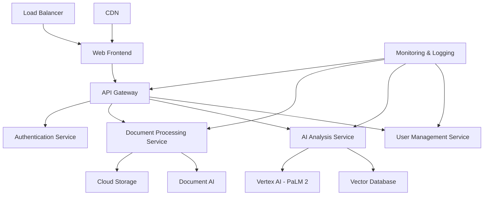

# Design Document

## Overview

The Legal Document AI Assistant is a cloud-native web application built on Google Cloud Platform that leverages advanced generative AI to make legal documents accessible to everyday users. The system combines document processing, natural language understanding, and intelligent analysis to provide real-time legal document insights while maintaining strict privacy and security standards.

## Architecture

### High-Level Architecture



### Technology Stack

**Frontend:**

- React.js with TypeScript for type safety
- Material-UI for consistent, accessible design
- Progressive Web App (PWA) capabilities for mobile optimization
- WebRTC for secure file upload

**Backend:**

- Node.js with Express.js framework
- Google Cloud Run for serverless container deployment
- Google Cloud Functions for event-driven processing
- Google Cloud API Gateway for request routing and rate limiting

**AI/ML Services:**

- Google Cloud Document AI for document parsing and OCR
- Vertex AI with PaLM 2 for text analysis and generation
- Vector embeddings for semantic document search
- Cloud Translation API for multi-language support

**Data Storage:**

- Google Cloud Storage for temporary document storage
- Cloud Firestore for user data and document metadata
- Cloud SQL (PostgreSQL) for structured data and audit logs
- Vector database (Pinecone or Weaviate) for semantic search

**Security & Compliance:**

- Google Cloud Identity and Access Management (IAM)
- Cloud Key Management Service (KMS) for encryption
- Cloud Security Command Center for monitoring
- VPC with private subnets for sensitive operations

## Components and Interfaces

### 1. Document Processing Pipeline

**Document Ingestion Service**

- Accepts PDF, DOC, DOCX, TXT files up to 50MB
- Validates file types and scans for malware
- Converts documents to standardized text format using Document AI
- Extracts metadata (document type, jurisdiction indicators, key sections)

**Text Preprocessing Service**

- Cleans and normalizes extracted text
- Identifies document structure (headers, clauses, sections)
- Performs named entity recognition for legal terms
- Creates document embeddings for semantic analysis

### 2. AI Analysis Engine

**Legal Document Analyzer**

- Utilizes fine-tuned PaLM 2 model for legal document understanding
- Identifies document type and applicable jurisdiction
- Extracts key terms, obligations, and potential risks
- Generates plain-language summaries and explanations

**Risk Assessment Module**

- Analyzes clauses against known problematic patterns
- Assigns risk scores based on legal precedents and common issues
- Identifies unusual or potentially unfavorable terms
- Generates specific warnings and recommendations

**Question-Answering System**

- Maintains conversation context using session management
- Retrieves relevant document sections using vector similarity search
- Generates contextual responses with source citations
- Handles follow-up questions and clarifications

### 3. User Interface Components

**Document Upload Interface**

- Drag-and-drop file upload with progress indicators
- Mobile camera integration for document capture
- Real-time file validation and error handling
- Secure upload with client-side encryption

**Analysis Dashboard**

- Document summary with key highlights
- Interactive risk assessment visualization
- Clause-by-clause breakdown with explanations
- Downloadable reports in PDF format

**Chat Interface**

- Real-time question-answering system
- Conversation history and context preservation
- Source citation and reference linking
- Suggested follow-up questions

### 4. Security and Privacy Layer

**Data Encryption Service**

- End-to-end encryption for document uploads
- AES-256 encryption for data at rest
- TLS 1.3 for data in transit
- Key rotation and management via Cloud KMS

**Privacy Management System**

- Automatic document deletion after 24 hours
- User consent management and GDPR compliance
- Data anonymization for analytics
- Audit logging for compliance reporting

## Data Models

### Document Model

```typescript
interface Document {
  id: string;
  userId: string;
  filename: string;
  documentType:
    | "contract"
    | "lease"
    | "terms_of_service"
    | "privacy_policy"
    | "loan_agreement"
    | "other";
  jurisdiction: string;
  uploadedAt: Date;
  expiresAt: Date;
  status: "processing" | "analyzed" | "error";
  metadata: {
    pageCount: number;
    wordCount: number;
    language: string;
    extractedText: string;
  };
  analysis: DocumentAnalysis;
}
```

### Analysis Model

```typescript
interface DocumentAnalysis {
  summary: string;
  riskScore: "low" | "medium" | "high";
  keyTerms: KeyTerm[];
  risks: Risk[];
  recommendations: string[];
  clauses: Clause[];
  generatedAt: Date;
}

interface KeyTerm {
  term: string;
  definition: string;
  importance: "high" | "medium" | "low";
  location: TextLocation;
}

interface Risk {
  category: "financial" | "legal" | "privacy" | "operational";
  severity: "high" | "medium" | "low";
  description: string;
  affectedClause: string;
  recommendation: string;
}
```

### User Model

```typescript
interface User {
  id: string;
  email: string;
  profile: {
    name: string;
    userType: "individual" | "small_business" | "enterprise";
    jurisdiction: string;
    preferences: UserPreferences;
  };
  subscription: {
    plan: "free" | "premium" | "enterprise";
    documentsRemaining: number;
    renewsAt: Date;
  };
  createdAt: Date;
}
```

## Error Handling

### Document Processing Errors

- **File Format Errors**: Clear messaging for unsupported formats with suggested alternatives
- **Size Limit Errors**: Progressive upload with compression suggestions
- **OCR Failures**: Fallback to manual text input with guided assistance
- **Timeout Errors**: Graceful degradation with partial analysis results

### AI Analysis Errors

- **Model Unavailability**: Fallback to cached responses and retry mechanisms
- **Context Length Limits**: Document chunking with section-based analysis
- **Confidence Thresholds**: Clear indicators when AI confidence is low
- **Bias Detection**: Warnings when analysis may be incomplete or biased

### System-Level Errors

- **Rate Limiting**: Clear messaging with upgrade paths for premium features
- **Authentication Failures**: Secure session management with automatic retry
- **Network Issues**: Offline capability with sync when connection restored
- **Data Corruption**: Checksums and validation with automatic recovery

## Testing Strategy

### Unit Testing

- Component-level testing for all React components using Jest and React Testing Library
- Service-level testing for all backend APIs with comprehensive mocking
- AI model testing with curated legal document datasets
- Security testing for encryption and authentication flows

### Integration Testing

- End-to-end document processing pipeline testing
- AI service integration testing with real document samples
- Cross-browser compatibility testing for web interface
- Mobile responsiveness testing across device types

### Performance Testing

- Load testing for concurrent document processing
- Stress testing for AI model response times
- Memory usage optimization for large document handling
- Network performance testing for various connection speeds

### Security Testing

- Penetration testing for authentication and authorization
- Data encryption validation at rest and in transit
- Privacy compliance testing for GDPR and CCPA requirements
- Vulnerability scanning for dependencies and infrastructure

### User Acceptance Testing

- Usability testing with target user groups (individuals, small businesses)
- Accessibility testing for WCAG 2.1 AA compliance
- Legal accuracy validation with legal professionals
- Multi-language testing for international users

### Compliance Testing

- GDPR compliance validation for EU users
- CCPA compliance validation for California users
- SOC 2 Type II audit preparation and validation
- Legal disclaimer and limitation testing
